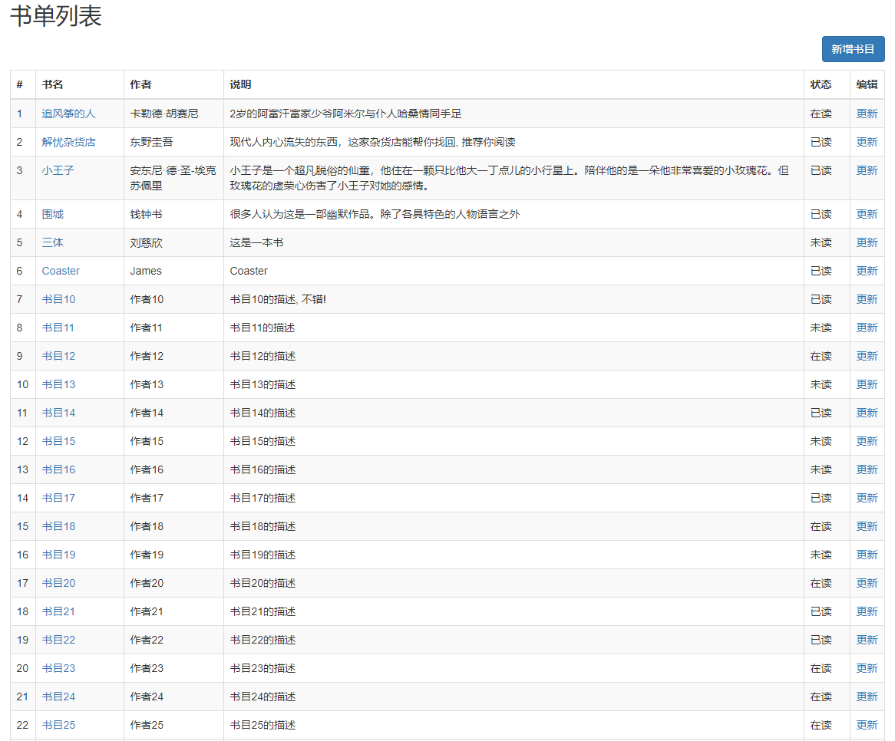
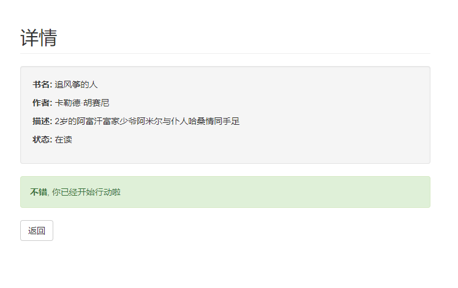
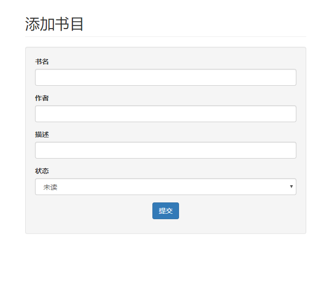
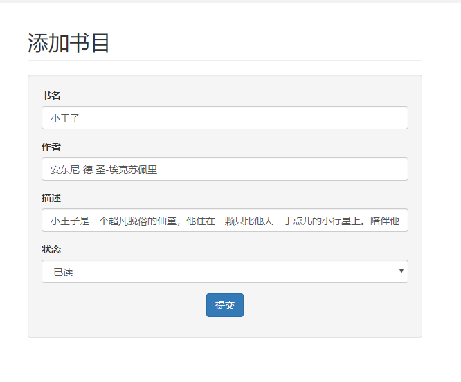

# 基于spring-boot 简单的书单管理系统
书单管理系统

# 环境: 

Java 8 MySQL 5.7

# 技术栈:

基于 springBoot 2.1.1 

持久层: Spring-Data JPA

前端部分: thymeleaf 3 + bootstrap 3

构建工具: maven

版本详情见pom.xml


# 实现效果(图): 

书单列表页:



书单详情页



添加书目页面:



修改书目页面:



# 更新日志
```
2018/12/11
1 添加编辑列, 实现书目更新功能
2 添加新增书目功能
```

# 下一步
### 1 在书单列表新添加列, 可以根据已有的状态显示不同的修改按钮

```
在书单列表新添加列, 可以根据已有的状态显示不同的修改按钮

例如, 如果该书未读, 则显示`标记为在读`
     如果该书在读, 则显示 `标记为已读`
     如果已读, 则显示 `标记为未读`
```
### 2 添加删除书目功能
### 3 关键字查询书目功能(Ajax)
### 4 部署至阿里云