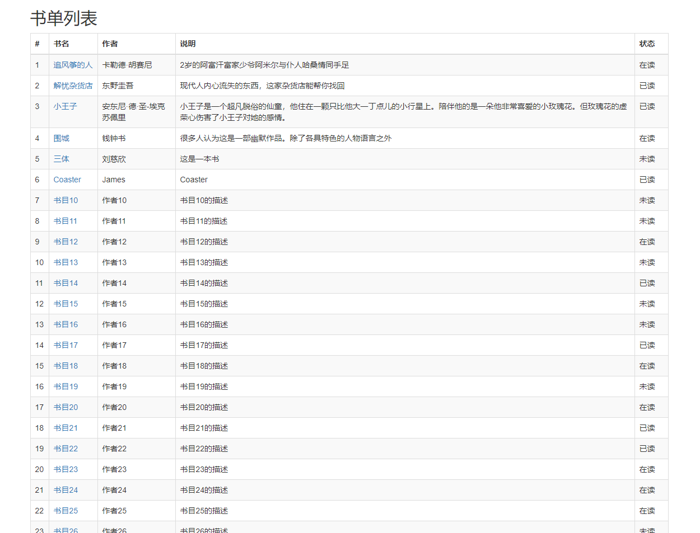

# spring-boot 非常简单(lou)的书单管理系统
udemy course 书单管理系统

#环境: 

Java 8 Idea 2018 MySQL 5.7

#技术栈:

SpringBoot + Spring-Data JPA + maven 

前端渲染:thymeleaf + bootstrap

详情见pom.xml

#实现效果: 

显示所有书单, 单击书名进入详情页面, 单击返回按钮返回书单列表

# 效果图:

# 下一步
## 1 在书单列表新添加列, 可以根据已有的状态显示不同的修改按钮

在书单列表新添加列, 可以根据已有的状态显示不同的修改按钮

例如, 如果该书未读, 则显示"标记为在读"
     如果该书在读, 则显示 "标记为已读"
     如果已读, 则显示一个绿色的钩
## 2 在页面上添加新增书目功能